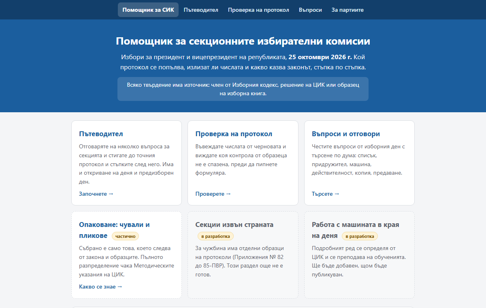

# Помощник за СИК

[](https://github.com/david-asenoff/sikinfo/actions/workflows/build.yml)
[](LICENSE)

### 🔗 [sikinfo.com](https://sikinfo.com/)

**Безплатен помощник за членовете на секционните избирателни комисии: кой протокол се
попълва, излизат ли числата и какво казва законът, стъпка по стъпка.** Всяко твърдение сочи
към източника си: член от Изборния кодекс, решение на ЦИК или образец на изборна книга.

Текущи избори: за президент и вицепрезидент на републиката, 25 октомври 2026 г.



## Какво прави

| Раздел | За какво служи |
|---|---|
| **Пътеводител** | Няколко въпроса за секцията (машина, хартия, преустановено машинно гласуване) водят до точния образец на протокол и до стъпките след него: броене, подписване, копия, предаване. Отделни маршрути за предизборния ден и за откриването на изборния ден. |
| **Проверка на протокол** | Въвеждат се числата от черновата. Всяка неспазена контрола от образеца свети до самото поле, с подсказка каква стойност би я оправила. Режим „Пример с обяснения“ показва попълнен измислен протокол и откъде идва всяко число. Приложения № 78-ПВР-х, 79-ПВР-м, 80-ПВР-кр-х и 81-ПВР-кп. |
| **Въпроси и отговори** | Честите въпроси от изборния ден с търсене по дума и филтър по тема. Всеки отговор сочи към източника си. |
| **За партиите** | Образците за удостоверения на членове на СИК (Приложения № 31, 32 и 33-ПВР) като Word и Excel двойки за циркулярен печат, с [видео](https://youtu.be/g_KfN2fqOrg). |

Работи на телефон и без интернет след първото отваряне. Въведените числа не напускат
устройството. Което още не е публикувано от ЦИК (разпределението по пликове и чували,
подробният ред за машината, секциите извън страната), е отбелязано като „в разработка“ и не
се твърди.

## Принципи

1. **Нищо без източник.** Стъпка или отговор без публикуван документ не влиза. Съдържание от
   практиката на предишни избори носи етикет „от предишни избори“ и чака потвърждение.
2. **Преразказ, не тълкуване.** Където документите мълчат, сайтът го казва и праща към РИК.
3. **Контролите са от образеца**, цитирани дословно. Проверката хваща аритметика, не замества
   изчислителния пункт.
4. **Данните остават при човека.** Числата се пазят само в раздела на браузъра.
   `Content-Security-Policy` позволява връзка единствено към анонимната статистика на
   посещенията ([Umami](https://umami.is/), без бисквитки). Подробно:
   [поверителност](https://sikinfo.com/poveritelnost.html).
5. **Проверимо.** Всеки push минава през [`scripts/check-content.js`](scripts/check-content.js):
   източници, възли, полета, примери и страници се проверяват, че се връзват. Червена проверка
   не се публикува.

Проектът е личен и безплатен. Не е свързан с ЦИК, РИК или партия и не е официален източник.
При разминаване важи официалният документ.

## Как е направено

Сайтът е статични страници без рамки и без зависимости: обикновен HTML, CSS и JavaScript в
`src/SikInfo.Web/wwwroot`. Цялата логика е в браузъра. Съдържанието е отделено от кода в
четири файла с данни, така че поправка в текст е промяна в един файл, а не в програма:

```
wwwroot/js/data/sources.js          източниците, с адресите им в cik.bg и lex.bg; датата на актуалност
wwwroot/js/data/guide-data.js       пътеводителят: въпроси, избори, резултати, стъпки
wwwroot/js/data/protocols-data.js   протоколите: полета, контроли и примерите за обучение
wwwroot/js/data/faq-data.js         въпросите и отговорите
wwwroot/js/data/ballot-data.js      кандидатските листи по номера, генериран от решението на ЦИК
```

Тънко ASP.NET Core приложение (`net10.0`) само раздава файловете със заглавки за сигурност,
пренасочване към `https` и от стария домейн, и се публикува на споделен IIS хостинг с
`hostingModel="OutOfProcess"`. Няма сървърен код за страниците, няма база данни, няма тайни
за пазене.

Въпросите и пълният текст на пътеводителя са вписани и като обикновен HTML в страниците
(`scripts/render-static.js`), за да ги виждат търсачките и хората без JavaScript; скриптовете
само добавят търсенето, филтъра и отметките. Проверката в GitHub не минава, ако вписаното е
остаряло спрямо данните.

Страниците се пазят от service worker по правилото „първо мрежата, кешът е резерв“: при
връзка се вижда последната версия, без връзка последно отворената.

## Стартиране

```
dotnet run --project src/SikInfo.Web
```

и <http://localhost:8765/>. След промяна в съдържанието: вписване в страниците, проверка и
build, същите като в GitHub:

```
node scripts/render-static.js
node scripts/check-content.js
dotnet build SikInfo.slnx
```

Word и Excel двойките за удостоверенията се строят от оригиналите на ЦИК с:

```
dotnet run --project src/SikInfo.Tools -- 2026-10-25-PVR
```

Публикуването е обикновен `dotnet publish` на `src/SikInfo.Web` към IIS хостинг; генерираният
`web.config` е с `hostingModel="OutOfProcess"`.

## Структура на репото

```
2026-10-25-PVR/            Word и Excel двойките за удостоверенията, примери, оригинали, инструкция
2026-10-25-PVR.zip         същата папка като един файл, за изтегляне от сайта
src/SikInfo.Web/           сайтът: ASP.NET Core приложение, което раздава wwwroot/
src/SikInfo.Tools/         конзолен инструмент: строи двойките и ZIP файла от оригиналите
scripts/render-static.js   вписва съдържанието като HTML в страниците и прави картата на сайта
scripts/check-content.js   проверката на съдържанието, тече локално и в GitHub
docs/                      изображения за README
.github/workflows/         автоматичната проверка при всеки push
```

За всеки следващ избор се добавя нова папка със същата структура; старите остават за справка.

## Клонове

| Клон | Какво е |
|---|---|
| `main` | Публикуваната версия. Влиза само прегледано съдържание. |
| `dev` | Работна версия. Съдържанието още се проверява спрямо източниците и може да съдържа грешки. Не бива да се ползва в изборния ден. |

## Принос

Грешка в съдържанието или липсващ въпрос: отворете [issue](../../issues) с документа, от който
следва отговорът. Как се добавя съдържание и какви са правилата: [CONTRIBUTING.md](CONTRIBUTING.md).

## Лиценз

[MIT](LICENSE). Ползвайте, променяйте и разпространявайте свободно.

Автор: [Давид Асенов](https://davidasenov.com/)
